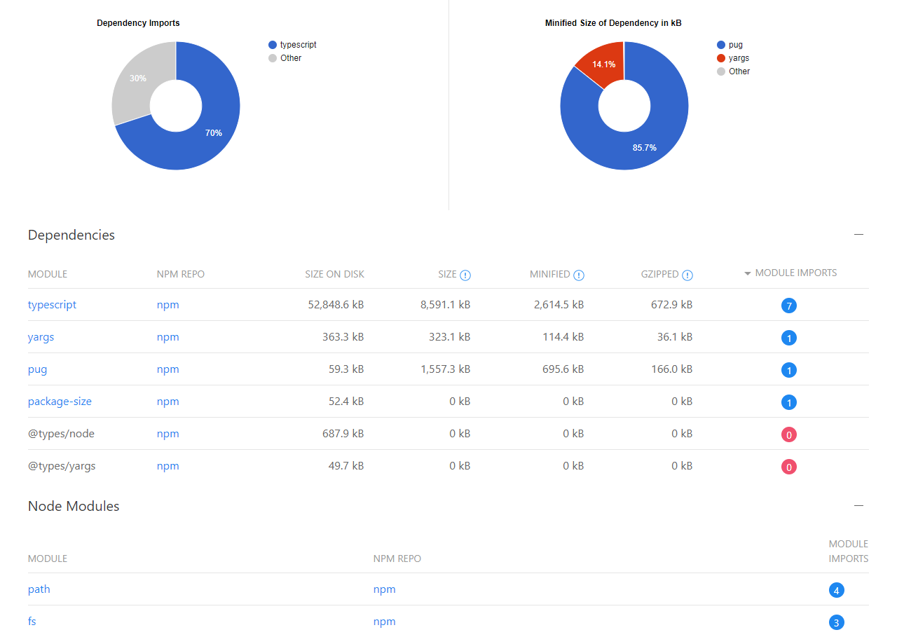
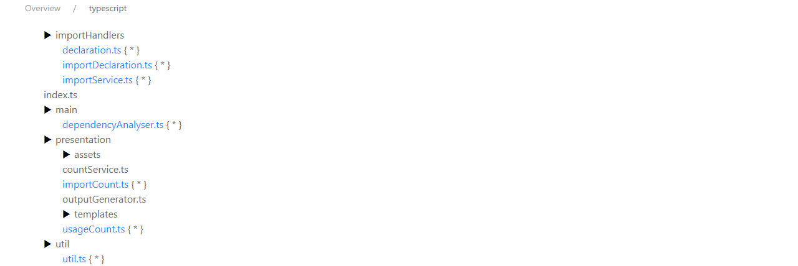
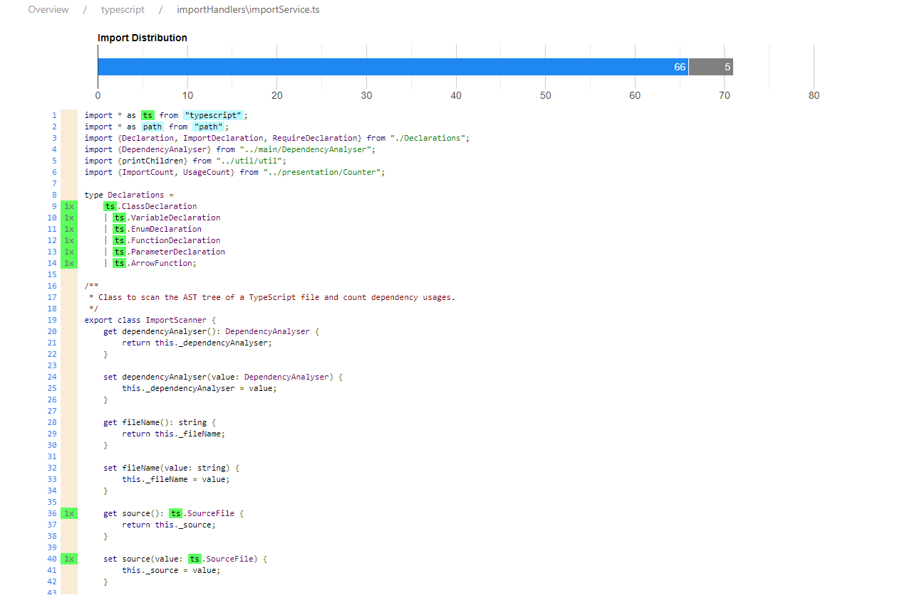

#dependency-analyser
Scan your Typescript project for imported and used dependencies and create a statistic as HTML output.







## Supported imports
https://developer.mozilla.org/en-US/docs/Web/JavaScript/Reference/Statements/import
```typescript
[✓] import defaultExport from "module-name";
[✓] import * as name from "module-name";
[✓] import { export1 } from "module-name";
[✓] import { export1 as alias1 } from "module-name";
[✓] import { export1 , export2 } from "module-name"; 
[✓] import { foo , bar } from "module-name/path/to/specific/un-exported/file";
[✓] import { export1 , export2 as alias2 , [...] } from "module-name";
[✓] import defaultExport, { export1 [ , [...] ] } from "module-name";
[✓] import defaultExport, * as name from "module-name";
[✗] import "module-name";  // marked as import, but no highlighting of usages
[✗] var promise = import("module-name"); // is not supported
```
```typescript
const module = require("module"); // is not supported
```

##Installing
```bash
npm install dependency-analyser
```

##Usage
```bash
dependency-analyser [options]
Options:
  --version   Show version number                                      [boolean]
  --root, -r  Root directory of your project.                           [string]
  --scan, -s  Directory to scan.                                        [string]
  --tar, -t   Target directory to put generated files into.             [string]
  -h, --help  Show help                                                [boolean]
```

##Examples
```bash
dependency-analyser --root C:/User/Projects/your_project

dependency-analyser --root C:/User/Projects/your_project --scan C:/User/Projects/your_project/src
```